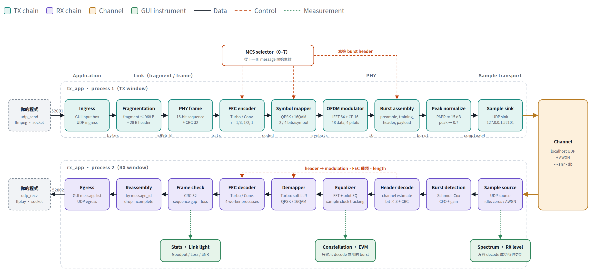

# ofdm-message-link：用 OFDM 傳影像與資料

把 webcam 的影像、或你自己程式的資料，經過一條 OFDM 無線 link 送到另一端。

這是一個用 GNU Radio 與 Python 寫的**教學用通訊系統範例**，讓你做兩件事：

1. **傳影像**：webcam → ffmpeg → OFDM link → ffplay，遺失 burst 時畫面會破，link 品質一眼就看得出來。
2. **用 UDP 傳任何資料**：把 bytes 送進發送端的 UDP `:52001`，從接收端的 UDP `:52002` 拿出來。
   你的程式只要會開 socket，不需要懂底下的 OFDM。

過程中的 spectrum、constellation、SNR 與 burst 遺失率都會即時畫出來。

- **沒有硬體也能跑**：`--transport udp` 用本機 UDP 模擬 channel，不需要 SDR、root 或 GPU。
  下面的三個步驟全部可以在一台筆電上完成。
- **有 SDR 就能真的發射**：`--transport uhd` 支援 USRP B210、NI USRP-2901 與 USRP N210；
  `--transport pluto` 支援 ADALM-Pluto。
- **可以自己加 SDR**：sample transport 是一個小介面，見 [新增一種 SDR](docs/05-add-a-new-sdr.md)。

TX 和 RX 是**兩個各自啟動的 process**，彼此只透過 sample transport 溝通，所以接收端顯示的內容
一定是真的從 waveform 解出來的。

[](https://s87315teve.github.io/ofdm-message-link/guide/)

> 👉 **互動導覽：<https://s87315teve.github.io/ofdm-message-link/guide/>**
> 點任何一個模組，看它做什麼、對應哪一段程式、在 GUI 的哪裡看得到；也可以調 message 大小與 MCS，
> 看 message 怎麼一層層包成 burst。離線時用瀏覽器開 [`guide/index.html`](guide/index.html) 也一樣。

## 這個範例是什麼、不是什麼

這是**單向** link：只有 TX → RX，沒有回傳路徑。所以：

- **沒有 ACK、沒有重傳（ARQ）、沒有 TDD**。遺失的 burst 就是遺失了，不會自己回來。
- 這讓你可以直接觀察「channel 變差時會發生什麼事」，不會被重傳機制蓋掉。
- 畫面上的 throughput、loss、SNR 是觀察用的即時讀數，不是正式的系統效能量測。

兩個視窗最上方都會一直標示這一點。

## 安裝

需要 Linux（在 Ubuntu 上開發與測試）與 [conda](https://docs.conda.io/)（Miniconda 或 Anaconda 都可以）。

```bash
git clone https://github.com/s87315teve/ofdm-message-link.git
cd ofdm-message-link

conda env create -f environment.yml      # 第一次約需數分鐘；GNU Radio、UHD、libiio、PyQt5 都在裡面
conda activate ofdm-message-link
pip install -e .                         # 會編譯一個 C++ 的 Turbo decoder

python -m pytest -q                      # 選用：確認安裝正確，全部應該通過
```

之後每開一個新的終端機，都要先 `cd` 到這個資料夾並 `conda activate ofdm-message-link`。
**所有指令都從 repository root 執行**（程式用相對路徑讀 `configs/`）。

## 三步上手（不需要硬體）

### 第一步：先讓 link 通

開**兩個終端機**。

**① 終端機 1：接收端**（先開，它要先佔住 sample transport 的 port）：

```bash
python -m ofdm_message_link.rx_app --snr-db 20
```

**② 終端機 2：發送端**：

```bash
python -m ofdm_message_link.tx_app
```

**③ 在發送端視窗的輸入框打字、按 Enter。** 接收端視窗會列出這則 message、更新 constellation 與 spectrum，
並累加統計。`--snr-db 20` 讓接收端加上 AWGN（一種隨機 noise），constellation 才看得出 noise 擴散。
不熟 constellation、SNR、AWGN 這些名詞的話，請看[先備觀念與名詞表](docs/00-prerequisites.md)。

| 發送端 | 接收端 |
|---|---|
|  |  |

兩個視窗先不要關，下面兩步會繼續用。

### 第二步：用 UDP 傳你自己的資料

再開兩個終端機：

```bash
# 終端機 3：收。印出從 link 另一端出來的每一則 message
python -m ofdm_message_link.udp_recv

# 終端機 4：送
python -m ofdm_message_link.udp_send "Hello over OFDM!"
python -m ofdm_message_link.udp_send '{"altitude": 150.3, "velocity": 18.7}'
python -m ofdm_message_link.udp_send --file /path/to/photo.jpg
```

自己的程式也只要幾行：

```python
import socket
socket.socket(socket.AF_INET, socket.SOCK_DGRAM).sendto(b"hi", ("127.0.0.1", 52001))
```

一個 UDP datagram 就是一則 message。大於 968 bytes 的 message 會自動切成多個 burst、在接收端組回來。

### 第三步：傳影像

把 `udp_recv` 關掉（終端機 3 按 Ctrl-C），並把接收端**重新啟動**，讓它把資料轉到 ffplay 用的 port：

```bash
# 終端機 1：接收端（Ctrl-C 關掉原本的，改用這行）
python -m ofdm_message_link.rx_app --snr-db 20 --egress-port 52012

# 終端機 3：播放
ffplay -fflags nobuffer -flags low_delay -framedrop \
    "udp://127.0.0.1:52012?fifo_size=100000&overrun_nonfatal=1"

# 終端機 4：webcam → H.264 → 752-byte UDP datagram
ffmpeg -nostdin -f v4l2 -input_format mjpeg -video_size 1280x720 -framerate 15 -i /dev/video0 \
    -vf format=yuv420p -c:v libx264 -preset ultrafast -tune zerolatency \
    -b:v 750k -maxrate 750k -minrate 750k -bufsize 375k \
    -x264-params "nal-hrd=cbr:force-cfr=1:intra-refresh=1:keyint=30:repeat-headers=1" \
    -muxrate 832k -f mpegts "udp://127.0.0.1:52001?pkt_size=752"
```

ffplay 的視窗會出現 webcam 的畫面。沒有 webcam 的話，把 `-f v4l2 -input_format mjpeg -video_size
1280x720 -framerate 15 -i /dev/video0` 換成 `-re -f lavfi -i testsrc=size=1280x720:rate=15`，
會送出測試圖樣。

**現在可以動手試：**

1. 把接收端的 `--snr-db` 降到 8 再重開，看畫面什麼時候開始破、`Link` light 怎麼變色。
2. 在 TX 視窗的 `MCS for next message` 選單換成 MCS 4（16QAM），同樣的 SNR 下比較畫面。
3. MCS 4 能承載比較高的 bitrate：把 ffmpeg 的 `750k`／`375k`／`832k` 換成 `1300k`／`650k`／`1440k`
   （需要較高的 SNR）。

每個參數為什麼這樣設、怎麼選 MCS 與 bitrate、一鍵啟動的腳本，見
[用 UDP 傳資料與傳影像](docs/03-your-own-app.md)。

### 換成真的 SDR

上面三步把 `--transport udp` 換成 `--transport uhd` 或 `--transport pluto`，就是真的無線傳輸。
**發射前請先讀[用真的 SDR 發射](docs/04-ota-hardware.md)**：先用 cable 加 attenuator，
並向指導老師確認可以使用的頻段與功率。

## 接下來讀什麼

要傳影像或資料，直接看第 3 篇。想弄懂原理，從第 0 篇開始，依序讀 0 → 1 → 2 → 3。前四篇不需要硬體。
第 4、5、7 篇是進階內容，要用真的 SDR 或修改程式時再讀。

| # | 文件 | 內容 |
|---|---|---|
| 0 | [先備觀念與名詞表](docs/00-prerequisites.md) | dB 與 SNR、I/Q、constellation、FFT 與 OFDM 的關係；全部名詞的定義 |
| 1 | [系統架構](docs/01-architecture.md) | OFDM、FEC、MCS 各自解決什麼問題；一則 message 怎麼變成 burst；每個 block 做什麼、在哪個檔案 |
| 2 | [看懂 GUI](docs/02-gui.md) | Spectrum 與 constellation 怎麼讀、怎麼量 burst 遺失率、每個統計數字的意義與限制 |
| **3** | **[用 UDP 傳資料與傳影像](docs/03-your-own-app.md)** | **用 UDP socket 收送資料；webcam 影像串流的完整說明與一鍵腳本** |
| 4 | [用真的 SDR 發射](docs/04-ota-hardware.md) | **發射前必讀的注意事項**；USRP 與 ADALM-Pluto 的設定 |
| 5 | [新增一種 SDR](docs/05-add-a-new-sdr.md) | Sample transport 的介面，以及加一種新裝置要改哪幾個地方 |
| 6 | [收不到東西？](docs/06-troubleshooting.md) | 照順序檢查的排錯清單 |
| 7 | [參考資料](docs/07-reference.md) | 全部的命令列參數、MCS 表、設計上的技術細節 |
| 8 | [實測紀錄](docs/08-measurements.md) | 實機 OTA 的量測結果，以及一份完整的 [throughput 實驗報告](experiments/ota_udp_throughput/README.md) |

## 專案結構

```
ofdm-message-link/
├── src/
│   ├── ofdm_message_link/   應用程式：兩個視窗、fragment、sample transport、GUI
│   └── ofdm_link/           PHY library：FEC、OFDM、synchronization、equalization，以及 USRP 介面
├── configs/                 設定檔：default.yaml 加上 profiles/ 裡的一個 profile
├── docs/                    上表的文件
├── guide/                   互動導覽（純 HTML/JS，不需要 server）
├── experiments/             量測腳本與報告
├── scripts/                 webcam 影像 demo 的一鍵腳本
└── tests/                   測試：全部不需要硬體、display 或 root
```

兩個 package 的分工：**`ofdm_message_link` 只處理 bytes、視窗與 radio 的選擇；`ofdm_link.phy` 才是
把 bytes 變成 waveform 的地方。** 想研究 OFDM 或 FEC 的實作，讀 `src/ofdm_link/phy/`；想改 GUI
或加新的 SDR，讀 `src/ofdm_message_link/`。

## 測試

```bash
python -m pytest -q
```

全部 headless：不需要 SDR、display 或 root。修改程式之後先跑一次，可以馬上知道有沒有弄壞既有行為。
`tests/phy/` 測 PHY 的每一層，`tests/app/` 測應用程式（包含用上面的指令實際啟動兩個 app）。

## License

[GPL-3.0-or-later](LICENSE)。
