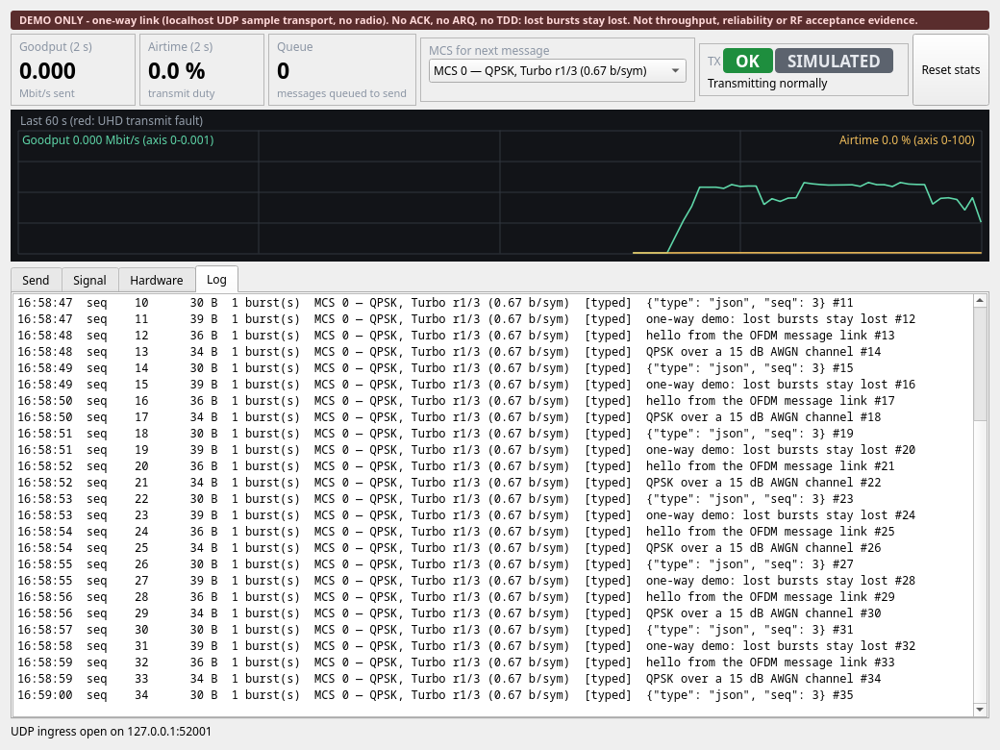
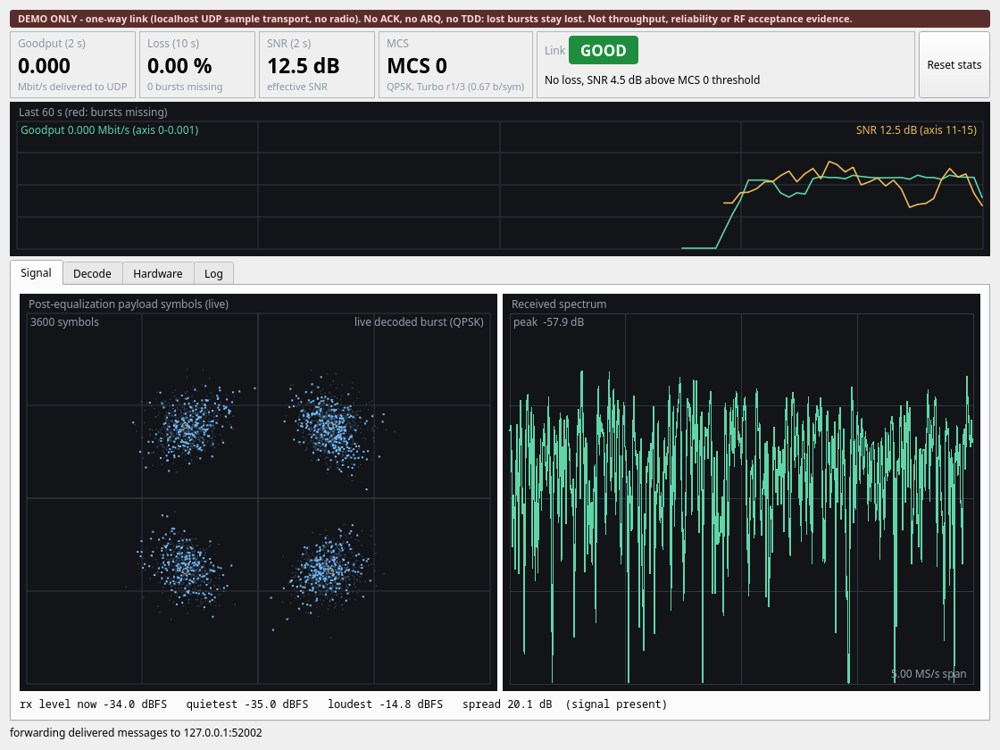

# 2. 看懂 GUI

GUI 的文字全部是英文。這篇說明每個區域在顯示什麼，以及怎麼從畫面判斷 link 的狀態。

## 2.1 視窗版面

兩個視窗都分兩層：**上層**固定在視窗頂端，一眼看出 link 好不好；**下層**是 tab，用來查問題。

| 發送端（停在 `Log` tab） | 接收端（停在 `Signal` tab） |
|---|---|
|  |  |

| 區域 | 接收端（RX） | 發送端（TX） |
|---|---|---|
| 最上方一行 | 提醒這是單向 demo（完整文字在 tooltip） | 同左 |
| 上層 cards | `Goodput (2 s)`、`Loss (10 s)`、`SNR (2 s)`、`MCS`、`Link` light | `Goodput (2 s)`、`Airtime (2 s)`、`Queue`、`MCS for next message` 下拉選單、`TX` light（`RF ON` 或 `SIMULATED`） |
| 60 秒 trend | Goodput 與 SNR，有 burst 遺失的時段紅底 | Goodput 與 Airtime |
| Tabs | `Signal`（constellation、spectrum、RX level）、`Decode`（decode funnel）、`Hardware`（Radio panel、UHD faults、engine 與 transport 資訊）、`Log` | `Send`（輸入框、Loss test、MCS 說明）、`Signal`、`Hardware`、`Log` |

- Light 右側是 **Reset stats**：只把畫面歸零（以目前計數當新基準），不重啟 radio。
- 打字聊天的流量只有每秒幾百 bytes，所以 `Goodput (2 s)` 顯示 `0.000`（單位是 Mbit/s）。
  影像 demo 時才會看到約 0.8。
- 視窗高度小於 600 px 時自動收起 tab，只留 cards 與 trend。
- `--geometry WxH+X+Y` 指定視窗位置與大小。

## 2.2 RX 的 cards 與 Link light

| Card | 內容 |
|---|---|
| `Goodput (2 s)` | 最近 2 秒送達 UDP 的 application bytes，Mbit/s |
| `Loss (10 s)` | 最近 10 秒遺失率 = missing ÷（decoded + missing）；10 秒內沒有預期中的 burst 時顯示 `—` |
| `SNR (2 s)` | 最近 2 秒解出 burst 的平均 effective SNR；2 秒內沒有 burst 時顯示 `—` |
| `MCS` | 最後一個解出 burst 的 header 所帶的 MCS |
| `Link` | 燈號加一行原因或建議 |

燈號依序判斷，第一個成立者勝出。規則集中在
[`dashboard.py`](../src/ofdm_message_link/dashboard.py)，不 import Qt，所以可以直接讀、直接測。

| 燈號 | 條件 | 原因文字範例 |
|---|---|---|
| 灰 `WAITING` | 從未解出任何 burst | `Waiting for the first burst` |
| 灰 `IDLE` | 超過 10 秒沒有 burst | `No bursts for 14 s — transmitter stopped or link lost` |
| 紅 `DOWN` | 超過 2 秒沒有 burst | `No bursts for 3 s` |
| 紅 `LOSSY` | 最近 10 秒遺失率 ≥ 1 % | `Loss 4.2 % in the last 10 s` |
| 黃 `LOSS` | 最近 10 秒遺失率 > 0 | `Loss 0.3 % in the last 10 s` |
| 黃 `MARGINAL` | SNR < 門檻 + 1 dB | `SNR 11.4 dB is within 1 dB of 11 dB needed for MCS 4` |
| 綠 `GOOD` | 其餘 | `No loss, SNR 2.3 dB above MCS 4 threshold` |

SNR 門檻只有兩個有實測值：MCS 4 為 11 dB、MCS 0 為 8 dB（來源見[實測紀錄](08-measurements.md)）。
其他 MCS 只依遺失率判斷，原因會註明 `no SNR threshold measured for MCS N`。紅燈或黃燈且 SNR
已低於目前 MCS 的門檻時，原因後面會附上 `— try MCS 0`。

## 2.3 TX 的 cards 與 light

TX 不知道 RX 有沒有收到（單向），所以不顯示遺失或 SNR。

| Card | 內容 |
|---|---|
| `Goodput (2 s)` | 最近 2 秒送出去的 application bytes，應與 RX 相近 |
| `Airtime (2 s)` | 最近 2 秒發射時間佔比 |
| `Queue` | 等待發送的訊息數，應維持在個位數 |
| `MCS for next message` | 下拉選單，可現場切換（下一則訊息起生效） |
| `TX` | 燈號，旁邊是 `RF ON`（真的 radio）或 `SIMULATED`（udp） |

TX 燈號：灰 `OFF` = radio 尚未啟動；紅 `FAULT` = 最近 10 秒 UHD 的 `tx_time_error`、underflow 或
sequence error 有增加；黃 `BUSY` = queue 連續 3 次刷新增加，或 airtime > 90 %；其餘綠 `OK`。

## 2.4 Spectrum 與 constellation 怎麼看

| | Spectrum | Constellation |
|---|---|---|
| 回答的問題 | 「外面有沒有東西？」 | 「解出來的 burst 品質如何？」 |
| 資料來源 | 每個收到的 raw sample chunk | 成功解出的 burst 的 equalized payload symbols |
| 什麼時候更新 | 固定 UI timer，**不論有沒有解出 burst** | 只在有 decoded burst 時；超過 3 秒沒有新的就轉灰並標示 `stale, last burst N s ago` |

- **Spectrum 在動、但 constellation 顯示 `no decoded burst yet` 或 `stale`**：samples 有進來，但近期沒有
  burst 通過 synchronization 與 CRC。
- **兩張圖都沒資料**：根本還沒收到 samples。
- Constellation 在 idle 時不會拿 raw noise 來畫。繞著原點的 noise cloud 看起來像訊號，會誤導判斷。
- 黃色參考點依實際 decoded burst 切換成 QPSK 的 4 點或 16QAM 的 16 點。
- GUI 預設每秒刷新 15 次（`--ui-fps` 調整）。統計文字每 0.5 秒更新。

**怎麼從 constellation 看 SNR：** 每一團點越小、越集中在黃色參考點上，SNR 越高。點團開始互相
碰到時，demapper 就會把某些 symbol 判到隔壁去，這時就要靠 FEC 修回來。16QAM 的點比 QPSK 密，
所以同樣大小的點團在 16QAM 會先互相碰到。這就是 16QAM 需要較高 SNR 的原因。

### RX level

`Signal` tab 下方有一行讀數：

```
rx level now -64.7 dBFS   quietest -65.2 dBFS   loudest -43.9 dBFS   spread 21.3 dB  (signal present)
```

**`spread` 才是關鍵。** 沒接東西的 antenna port 會一直停在自己的 noise floor，spread 接近 0；
有 signal 的 port 會隨發射開關明顯跳動。用法見[排錯清單](06-troubleshooting.md)。

## 2.5 量測 packet loss（PER）

發送端 `Send` tab 有 **Loss test**：填數量後按 **Send batch**，會連續送出編號訊息。接收端的
`burst loss ratio`（在 `Decode` tab）就是 packet error rate，來源是 PHY frame sequence number 的缺口。

Send batch 不會因為 queue 塞滿而丟包。發送 thread 會等到有空位才送下一個 burst，所以統計上的
遺失一定來自 link，不是來自介面。

**一個可以做的小實驗：** 用模擬 transport，固定 MCS，把 `--snr-db` 從 20 每次降 1 dB，每個點用
Loss test 送 1000 則並記錄 loss。畫出 loss 對 SNR 的曲線，你會看到 FEC 的 waterfall：loss 在某個
SNR 附近突然從接近 0 升到接近 100%。換一個 MCS 再做一次，比較兩條曲線的位置。

## 2.6 統計數字的意義與限制

在 `Decode` tab，分「最近 10 秒」與「reset 後累計」兩欄。

| 欄位 | 意義 | 限制 |
|---|---|---|
| `bursts decoded` | 通過 CRC 的 burst 數 | — |
| `bursts missing` | 由 PHY sequence gap 推得的遺失 burst | **無法區分**「preamble 沒偵測到」與「CRC 失敗」，單向 link 本來就分不出來 |
| `burst loss ratio` | missing ÷ (decoded + missing) | 即 PER |
| `incomplete messages` | 缺 fragment 而被丟棄的訊息 | 永遠無法修復 |
| `foreign bursts` | CRC 有效但不是這個專案的格式 | 同一 channel 上的其他應用，不是 link 故障 |
| `mean EVM` / `effective SNR` | Decision-directed：以最近的 constellation 點為參考算出的誤差 | Error rate 一高就**會飽和**。它描述「解得出來的 burst」，不是 link 的失效門檻 |
| `mean one-way latency` | End-to-end latency | **只在收發同機時顯示**。跨主機沒有共同時間基準，所以直接顯示 `n/a` 而不是給假數字 |
| `delivered goodput` | Application bits ÷ wall clock | 包含打字等待時間，只是觀察用 |

**關於 effective SNR 的提醒：** 它只從成功解出的 burst 計算。Link 很差的時候，解得出來的都是
運氣比較好的那幾個，所以這個數字會比真實情況樂觀。判斷 link 好壞要同時看 loss。

## 2.7 `--stats-log`：把統計存成檔案

RX 加上 `--stats-log PATH` 之後，每次統計刷新（0.5 秒）附加一行 JSON，內容與畫面同一次計算：
`receiver`、`decoder`、`transport` 的累計計數，以及 `link_state`、`link_reason`、`loss_10s`
（比例，不是 %）、`snr_2s`、`mcs_index`。做實驗時用這個取數據，比看畫面抄數字可靠。

```bash
python -m ofdm_message_link.rx_app --snr-db 12 --stats-log rx_stats.jsonl
```

事後分析的例子：

```bash
python - rx_stats.jsonl <<'EOF'
import collections, json, sys
rows = [json.loads(line) for line in open(sys.argv[1])]
rows = [r for r in rows if "event" not in r]          # 略過 reset 事件
last = rows[-1]
print("decoded", last["receiver"]["bursts_decoded"],
      "missing", last["receiver"]["missing_bursts"])
print("light:", collections.Counter(r.get("link_state") for r in rows))
EOF
```

檔案預設到 16 MiB 就輪替成 `PATH.1`（`--stats-log-max-mb`、`--stats-log-backups` 可調）。
計數欄位是從視窗開啟起累計，所以最新一行永遠是總數。

下一篇：[用 UDP 傳資料與傳影像](03-your-own-app.md)。
