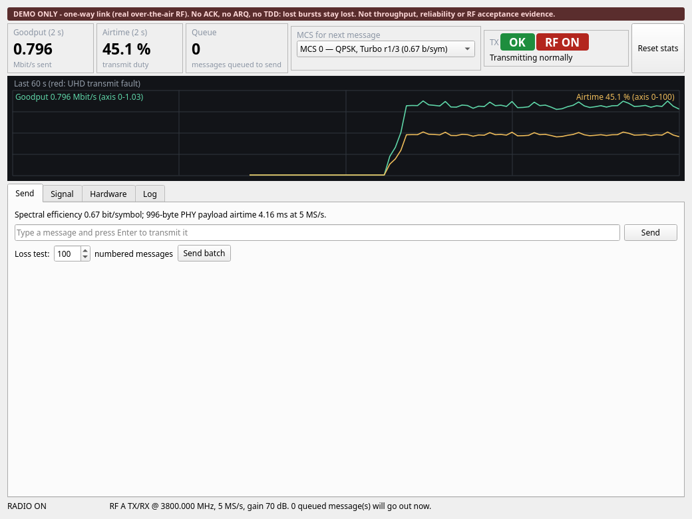
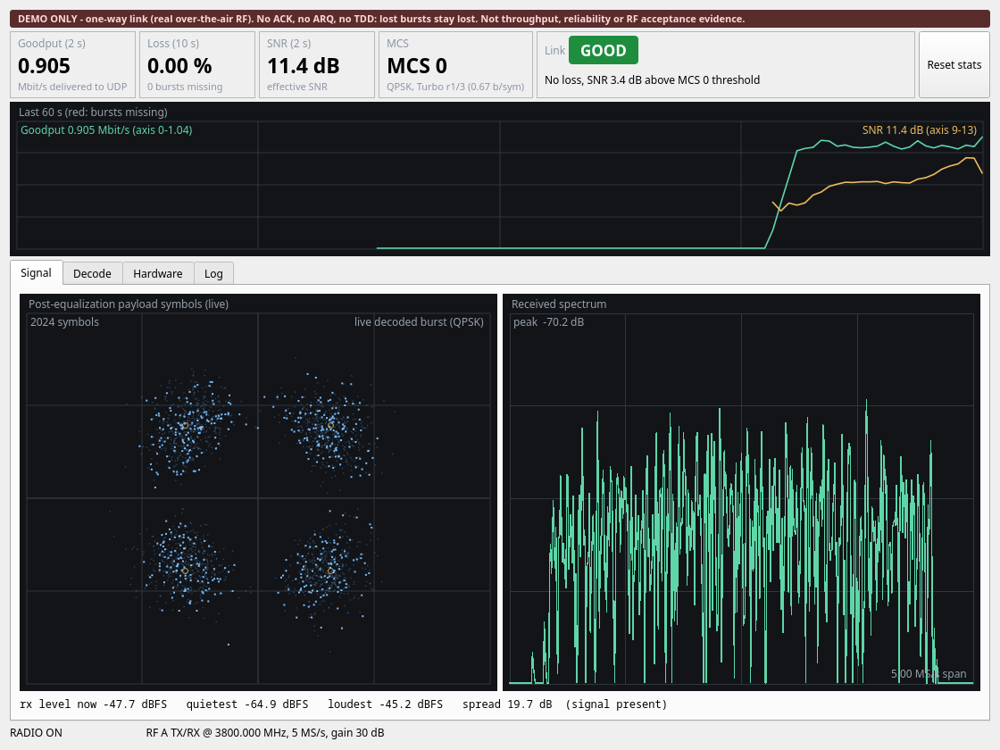
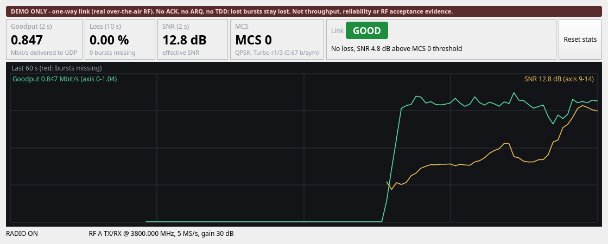

# 8. 實測紀錄

這個專案在實機上跑過的結果。除了當作「這條路徑真的會動」的證據，也可以當作你自己做實驗時
記錄方式的參考：寫清楚設備、設定、量到什麼、**以及沒有量到什麼**。

> **量測條件。** 以下都是同一張桌上的短距離、低功率量測。8.1–8.4 使用的 1.2 GHz 與 3.8 GHz 是當時
> 設備組合下選的頻率，**不是這個專案現在的預設值（2.45 GHz）**，也都不是 ISM 頻段。重現前請先確認你
> 所在場所可用的頻段與功率；不確定時改用 cable 加 attenuator（見[發射前必讀](04-ota-hardware.md#41-發射前必讀)）。
>
> 預設的 2.45 GHz profile 只有 8.5 的 Pluto 對 Pluto 短時間量測。

這些都是 demo 等級的觀察：單一擺放位置、時間短、沒有重複多次。不能當作 throughput 或 reliability
的正式結論。

## 8.1 B210 → NI USRP-2901，3.8 GHz

第一次把這條 link 搬到實機上。

| 項目 | 結果 |
|---|---|
| 發送 | B210，RF A `TX/RX`，TX gain 70 dB |
| 接收 | NI USRP-2901，RF A `TX/RX`，RX gain 30 dB |
| 設定 | `configs/profiles/b210_ota_3p8ghz.yaml`：3.8 GHz、5 MS/s、MCS 0 |
| 兩個獨立 process | 9 則訊息送達 7 則（含 JSON），bytes 完全正確 |
| 單一 process 的 run | 14 則送達 13 則，burst loss 7.14% |
| 離線 decode 錄下的 samples | 213 個 burst 解出 211 個，EVM 0.21–0.24、effective SNR 12–14 dB |
| 遺失的訊息 | **不會回來**。單向 link 沒有重傳 |

重現用的指令（兩端都要帶 overlay）：

```bash
# 終端機 1
python -m ofdm_message_link.rx_app \
    --overlay configs/profiles/b210_ota_3p8ghz.yaml \
    --transport uhd --serial <RX_SERIAL> --channel 0 --antenna TX/RX --gain 30 --auto-start

# 終端機 2
python -m ofdm_message_link.tx_app \
    --overlay configs/profiles/b210_ota_3p8ghz.yaml \
    --transport uhd --serial <TX_SERIAL> --channel 0 --antenna TX/RX --gain 70 --auto-start \
    --enable-rf \
    --acknowledgement 'I acknowledge that this process will transmit RF'
```

## 8.2 OTA 影像 demo，B210 → NI USRP-2901，3.8 GHz

`scripts/run_ota_video_demo.sh`，5 MS/s，TX 70 dB / RX 30 dB，1280×720 15 fps webcam。數字來自 RX 的
`--stats-log`（每 0.5 秒一筆）。「無遺失區間」是相鄰兩筆之間 `missing_bursts` 沒有增加的比例。

| 項目 | Run A：MCS 4 + 1.3 Mbit/s | Run B：MCS 0 + 0.75 Mbit/s |
|---|---|---|
| 影片時間 | 180 s | 119 s |
| 送達 burst / 遺失 burst | 32,206 / 11,840 | 16,818 / 420 |
| Burst loss | **26.9 %** | **2.4 %**（全部集中在一次約 7 秒的衰落） |
| 即時 goodput 中位數 / 最大 | 1.305 / 1.577 Mbit/s | 0.835 / 0.936 Mbit/s |
| 無遺失區間 | 152 / 359（42 %） | 226 / 239（95 %） |
| Effective SNR 範圍 | 7.6 – 13.0 dB | 4.5 – 13.6 dB |
| UHD `rx_overflow` / 遺失 samples | 0 / 0 | 0 / 0 |

解讀：

- **主機端沒有瓶頸**：兩次都 0 overflow、0 遺失 samples。遺失全部來自空中的 channel：SNR 會在幾秒內
  掉到 11 dB 以下（人走動、multipath 變化），掉包率與 SNR 下降同步。
- 這次的 SNR 平均約 11 dB，正好卡在 MCS 4 的門檻，所以 MCS 4 反覆破圖。**MCS 選得太激進的後果
  就長這樣。** 同樣的環境用 MCS 0 就穩定得多。
- 單向 link 沒有重傳，衰落期間的破圖無法修復；intra-refresh 讓畫面在約 2 秒內自行恢復。

另外一組在 SNR 較穩定時量的上限（同樣的設備與頻率，RX 4 個 decode worker）：

| 接收端 `SNR (2 s)` | 設定 | 無遺失上限（900-byte burst） | 752-byte datagram 上限 |
|---|---|---|---|
| ≥ 11 dB | 5 MS/s + MCS 4 | 每秒 400 個 burst，2.88 Mbit/s（94% duty） | 2.41 Mbit/s |
| 約 8–11 dB | 5 MS/s + MCS 0 | 每秒 230 個 burst，1.65 Mbit/s（98% duty） | 1.38 Mbit/s |

- MCS 4 在 TX 降 3 dB（SNR 約 9.7 dB）時已開始掉包（0.2%），降 6 dB 掉 16%；同樣條件下 MCS 0 仍是
  0 遺失。**GUI 裡 MCS 4 = 11 dB、MCS 0 = 8 dB 這兩個門檻就是從這裡來的。**
- 最高的穩定影片 bitrate：1.8 Mbit/s 60 秒 0 遺失；2.1 Mbit/s 60 秒掉 1 個 datagram。
- 一次 5 分鐘的 run（1.3 Mbit/s）：73,364 個 datagram，0 遺失、0 overflow。
- 10 MS/s 的 profile 在同樣的擺放下 SNR 掉了 2.5–5 dB（bandwidth 加倍，收進來的 noise 也加倍）：
  MCS 4 至少 1.4% 遺失。

下面兩張是這個 demo 的畫面（MCS 0、750 kbit/s）：

| 發送端（OTA） | 接收端（OTA） |
|---|---|
|  |  |

視窗高度小於 600 px 時只留 cards 與 trend：



## 8.3 OTA 影像 demo，N210 → NI USRP-2901，1.2 GHz

N210（CBX，RF1 = `TX/RX`，TX gain 5 dB）→ NI USRP-2901（`TX/RX`，RX gain 15 dB），
`configs/profiles/usrp_ota_1p2ghz.yaml`，5 MS/s，MCS 4，影片 1.3 Mbit/s，180 秒。
Antenna 是約 900 MHz 的 antenna，距離沒有量測。

| 項目 | 結果 |
|---|---|
| 送達 datagram / 遺失 | 43,862 / 246（**0.56 %**） |
| 無遺失區間 | 366 / 408（90 %）；**前 160 秒 0 遺失**，遺失全部集中在最後約 21 秒 |
| 即時 goodput 中位數 / 最大 | 1.448 / 1.610 Mbit/s |
| `SNR (2 s)` 範圍 | 15.6 – 17.3 dB（MCS 4 門檻 11 dB） |
| UHD `rx_overflow` / 遺失 samples / 時間不連續 | 0 / 0 / 0 |
| TX underflow / late | 0 / 0 |

解讀：

- 最後 21 秒的遺失全部是 payload CRC 失敗。當時 `SNR (2 s)` 仍然在 16 dB 左右，主機端也沒有 overflow。
  SNR 只從成功解出的 burst 計算，所以短暫的外部干擾會讓部分 burst 失敗，卻不會拉低這個數字。
  **原因沒有查明。** 結束後立刻用同樣設定重測（7,500 個 burst），結果是 0 遺失，所以不是穩定存在的問題。
- 1.2 GHz 位於衛星導航與 L-band 雷達等系統使用的頻段，無法排除外部干擾；這只是推測，沒有量測佐證。
- **RX gain 為什麼是 15 dB 而不是 30 dB：** 這個頻率的路徑損耗比 3.8 GHz 少約 10 dB。RX gain 30 dB
  時 signal 太強，接收端的 acquisition 跟不上，每秒 400 個 burst 時掉了 40%。

各 MCS 在這組設備上的完整 throughput 掃描，見
**[throughput 實驗報告](../experiments/ota_udp_throughput/README.md)**。

## 8.4 ADALM-Pluto → ADALM-Pluto，1.2 GHz

兩台 PlutoSDR Rev.B（官方韌體），各接原廠 antenna、放在同一張桌上，
`--transport pluto --overlay configs/profiles/usrp_ota_1p2ghz.yaml`、5 MS/s、MCS 0、900-byte 訊息，
兩個獨立 process。

| 方向 | Backend／韌體 | TX／RX gain | 速率 | 送達 | Burst loss | SNR | RX overflow |
|---|---|---|---:|---:|---:|---:|---:|
| A → B | `ip:`／v0.31→v0.30 | −15／15 dB | 150/s，8 秒 | 1,200／1,200 | 0 | 12.7 dB | 0 |
| A → B | `ip:`／v0.31→v0.30 | −15／15 dB | 100/s，90 秒 | 8,990／9,000 | 0.11% | 12.1 dB | 0 |
| B → A | `ip:`／v0.30→v0.31 | −15／15 dB | 100/s，60 秒 | 5,947／6,000 | 0.88% | 10.7 dB | 0 |
| **A → B** | **`usb:`／v0.39** | −15／15 dB | 100/s，30 秒 | 2,991／3,000 | 0.30% | 12.0 dB | 0 |
| **B → A** | **`usb:`／v0.39** | −15／15 dB | 100/s，30 秒 | 2,960／3,000 | 1.30% | 10.3 dB | 0 |

- 前三列是經 Pluto 的 USB 網路介面（libiio `ip:` backend）量的，當時主機還沒有裝 udev rule。
  後兩列是裝好 udev rule、兩台都更新到 v0.39 之後，直接走 USB backend 量的。
- 發送端在 MCS 0 約 190 burst/s 飽和；RX gain 30 dB 加上較強的 signal 會讓 acquisition 跟不上
  （150/s 時掉 86%）。
- **影像 demo**（`usb:`／v0.39，TX −10／RX 15 dB，750 kbit/s）：接收端收到 835 kbit/s，等於 ffmpeg
  送出的 832 kbit/s，30 秒內 4 個 burst 遺失、0 overflow。
- 最長 90 秒、單一擺放位置。

## 8.5 ADALM-Pluto → ADALM-Pluto，2.45 GHz（預設 profile）

兩台 PlutoSDR Rev.B（韌體 v0.39，USB backend），各接原廠 antenna、放在同一張桌上，預設的
`configs/profiles/ota_2p45ghz.yaml`、5 MS/s、MCS 0。

訊息：1000 個 900-byte datagram，每秒 100 個。

| TX／RX gain | 送達 | Burst loss | `SNR (2 s)` | RX overflow |
|---|---:|---:|---:|---:|
| −15／15 dB | 898／1,000 | **10.2%** | 7.1–8.2 dB | 0 |
| **−5／15 dB** | 1,000／1,000 | 0 | 15.2–16.6 dB | 0 |
| −5／30 dB | 1,000／1,000 | 0 | 22.8–23.7 dB | 0 |

- 1.2 GHz 時夠用的 TX −15 dB，在 2.45 GHz 只剩約 7–8 dB 的 SNR，低於 MCS 0 需要的 8 dB，所以掉了一成。
  遺失的 burst 幾乎都是 header 解不出來（99 個）。頻率越高路徑損耗越大是原因之一；antenna 與
  干擾的影響沒有另外量測。**換頻率之後 gain 要重新找。**
- TX 調高 10 dB，SNR 也大約升 8–9 dB，遺失歸零。

影像：`scripts/run_ota_video_demo.sh --transport pluto --auto-start`，TX −5／RX 15 dB，MCS 0，
750 kbit/s，1280×720 15 fps webcam，30 秒。

| 項目 | 結果 |
|---|---|
| 送達 burst / 遺失 | 4,253 / **0** |
| 即時 goodput 中位數 / 最大 | 0.835 / 0.860 Mbit/s |
| `SNR (2 s)` 範圍 | 15.8 – 16.6 dB |
| RX overflow | 0 |
| ffplay 的 `corrupt` 訊息 | 0 |
| Link light | 全程 `GOOD` |

每個設定只跑了一次，最長 30 秒，單一擺放位置。

## 8.6 沒有實測過的東西

誠實列出來，免得被誤認為已經驗證：

- **USRP 在預設的 2.45 GHz profile**，不論 OTA 或 cable（8.5 只量了 Pluto）。
- **任何 cable 加 attenuator 的量測。** 上面全部是 antenna。
- Pluto 與 USRP 各在一端的組合。
- 20 MS/s。
- MCS 1、2、3、5、6、7 的影像 demo（throughput 報告有它們的 UDP 掃描結果）。
- 超過幾分鐘的長時間穩定度。
- 不同的 antenna 距離與擺放。

如果你量了其中任何一項，那就是這個專案還沒有的新資料。

回到 [README](../README.md)。
